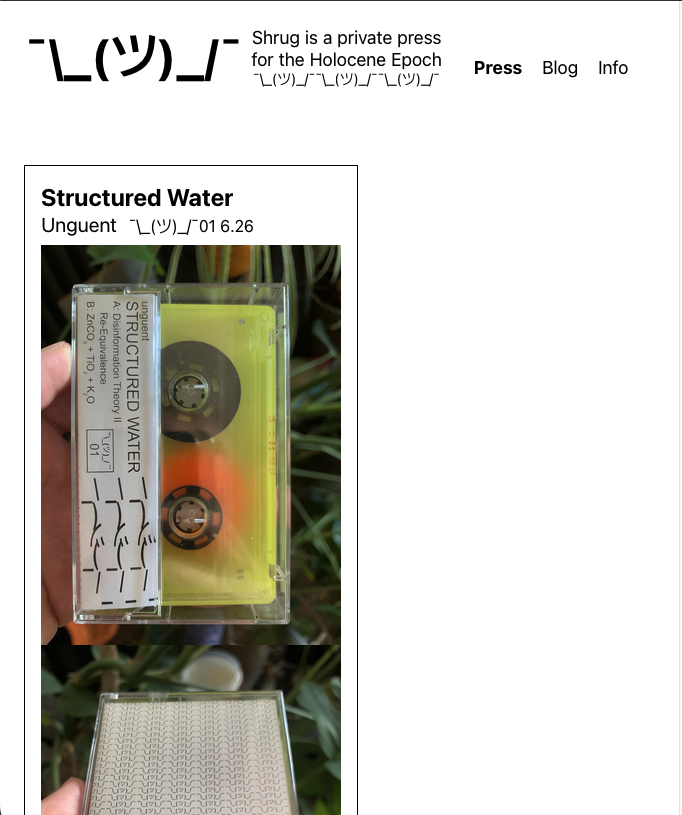
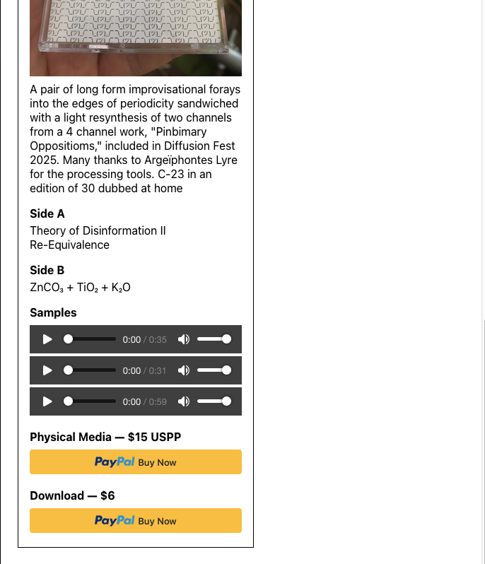
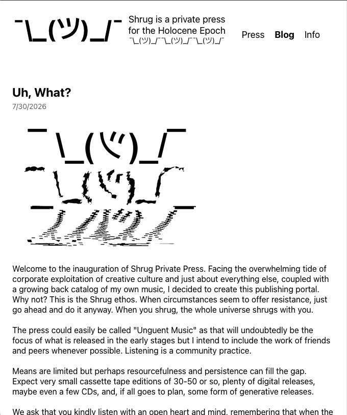
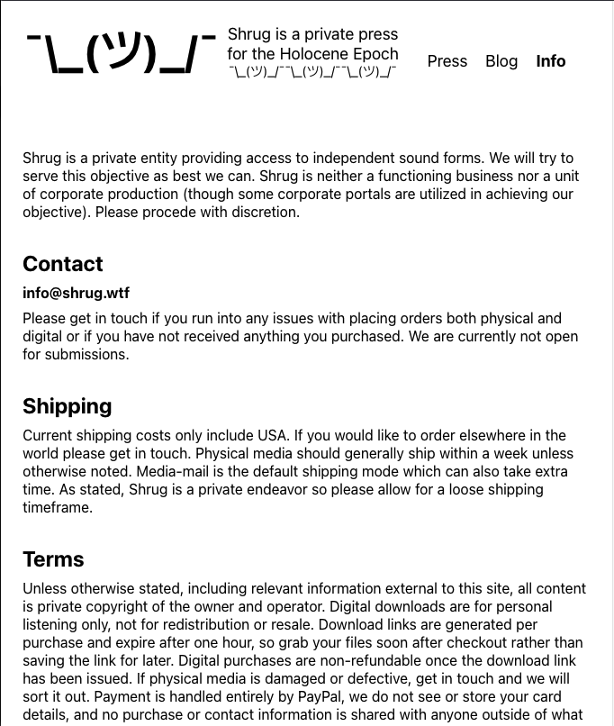
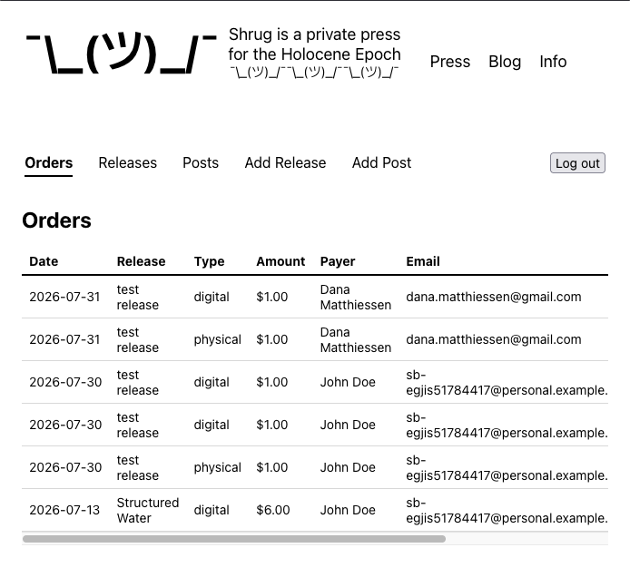
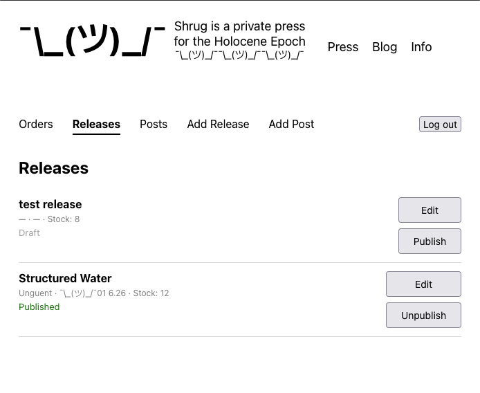
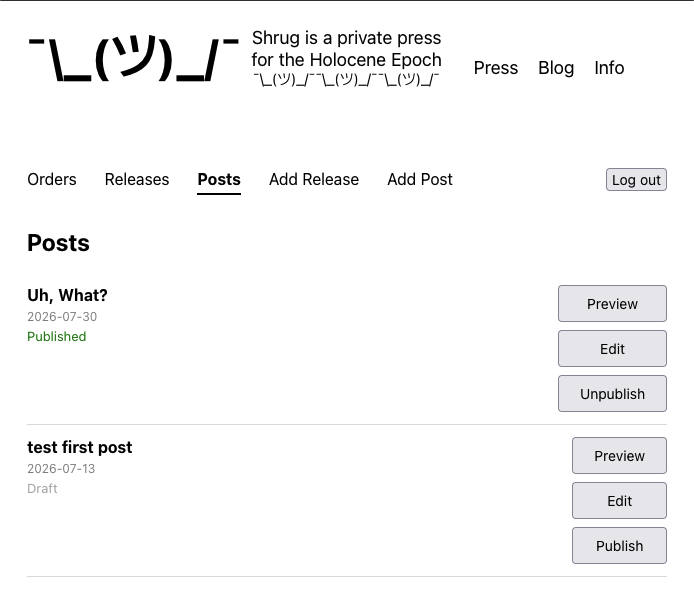
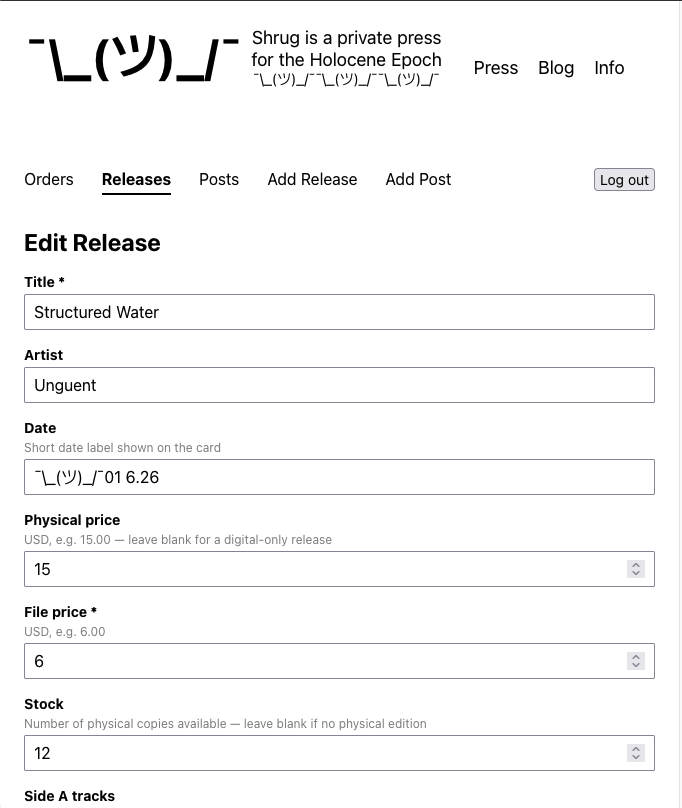
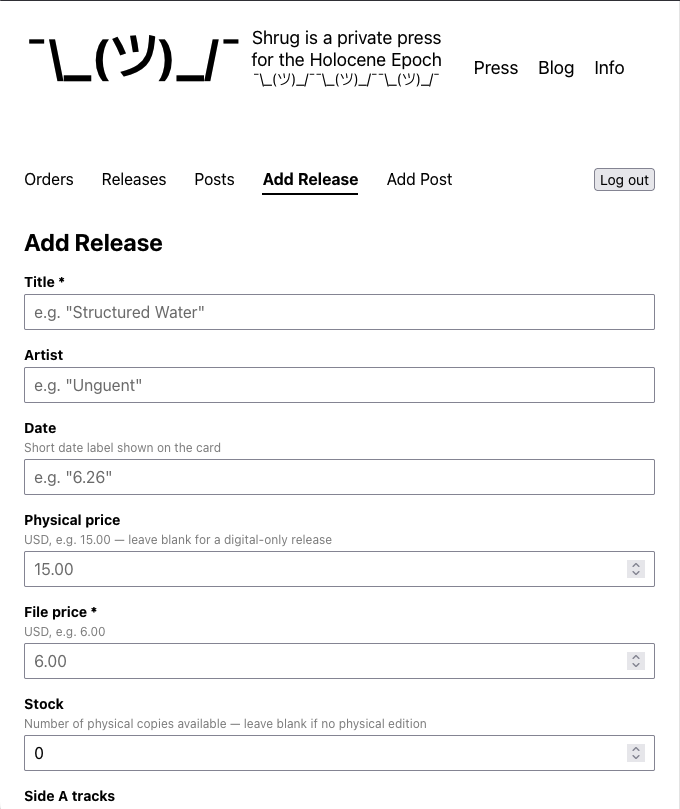
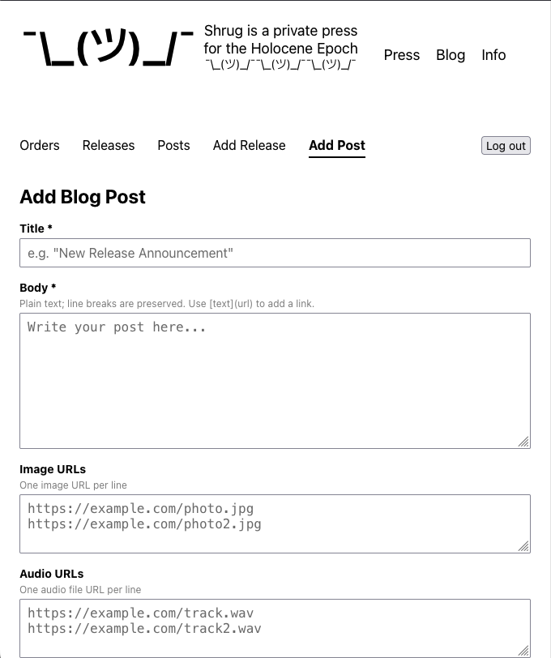

# Shrug Private Press

A publishing portal and storefront for independent expermental music. Features of the site include PayPal checkout for physical and digital purchases, a blog, and an admin dashboard for managing both. Built with a React frontend and a Node/Express + SQLite backend.

**Live Site:** [shrug.wtf](https://shrug.wtf)

## Screenshots












## Features

- Release catalog with track listings, audio samples, and cover art

- PayPal checkout for both physical (shipped) and digital (download) purchases

- Digital purchases get a time-limited signed download URL generated on successful payment

- Stock tracking for physical releases, with an oversell guard on capture

- Blog with Markdown-style links in post bodies

- Admin dashboard (`/admin`) for managing releases, posts, and orders, with a draft/publish workflow for both releases and posts

## Tech Stack

**Frontend**
- React 19
- React Router v6
- `@paypal/react-paypal-js`
- CSS Modules

**Backend**
- Node.js + Express
- `better-sqlite3` (SQLite)
- `@aws-sdk/client-s3` + `@aws-sdk/s3-request-presigner`

**APIs**
- PayPal Orders v2 REST API

## Architecture

```
React (Cloudflare Pages)
        |
        v
Express API (VPS, Caddy reverse proxy)
        |
        +--> SQLite (releases, orders, posts)
        +--> PayPal Orders v2 API (checkout + capture)
        +--> Cloudflare R2 (digital file storage, signed URLs)
```

Purchase type (`physical` or `digital`) is encoded into PayPal's `custom_id` at order creation and read back on capture, so a single capture route can decrement stock for physical orders and generate a signed R2 download link for digital orders without a second lookup.

## Notable design decisions

- Stock only decrements on a successful payment capture — never on order creation — and only for physical purchases; digital stock is unlimited.

- Releases and posts are created as drafts and published separately from the admin dashboard, so in-progress content never appears on the public site.

- `download_url` stores only the R2 object key; the actual signed URL is generated server-side per request and expires after an hour, so files are never publicly linkable.
