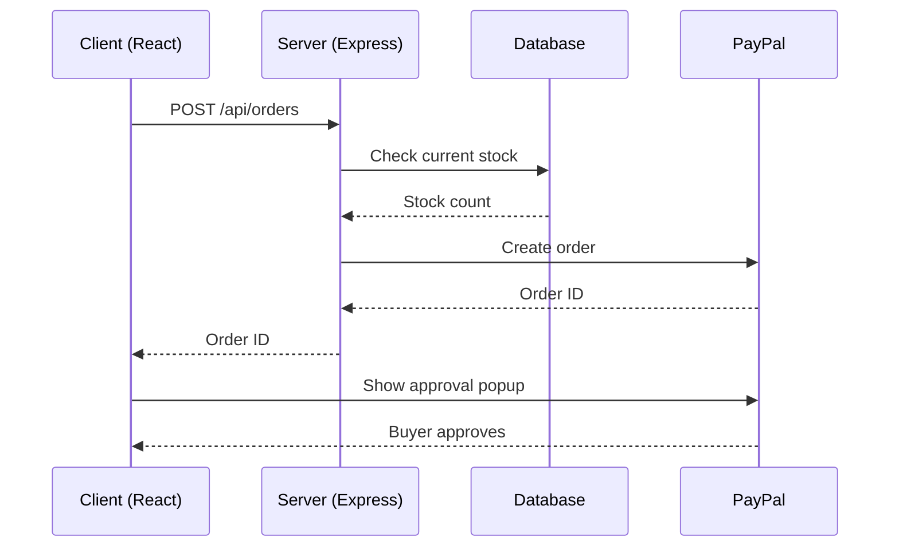
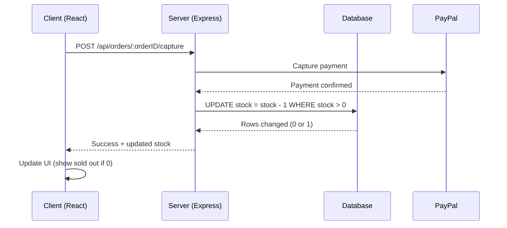

# PayPal Checkout & Stock Management Flow

How the frontend, server, database, and PayPal interact to process a purchase and keep stock accurate.

## Overview

The client never talks to PayPal or the database directly — the server is the only thing that does both. This keeps stock and pricing trustworthy: nothing the browser sends is ever taken at face value.

## Stage 1 — Order creation & PayPal approval

The stock check here is for UX only — it avoids opening the PayPal popup for a sold-out item. It is **not** what prevents overselling.

## Stage 2 — Capture & stock update

The conditional `UPDATE ... WHERE stock > 0` is the real safeguard. If two buyers race for the last copy, only one update affects a row — the other gets 0 rows changed and is treated as sold out.

## API endpoints

| Method | Path | Purpose |
|---|---|---|
| GET | `/api/releases` | List releases with current stock |
| POST | `/api/orders` | Create a PayPal order (checks stock first) |
| POST | `/api/orders/:orderID/capture` | Capture payment, decrement stock, record the order |
| POST | `/api/releases` | Admin-only (key-gated): add a new release |

## Key design principles

- **Decrement on capture, not on order creation.** An abandoned PayPal popup should never lock up stock.
- **Check stock twice.** Once for UX (before opening the popup), once atomically at capture time.
- **Never trust the client for price or quantity.** The server looks up current price and stock by release ID — it doesn't accept either from the request body.
- **Write to the data store synchronously, before responding success.** No deferred or batched writes — if the server crashes right after, the data on disk still reflects reality.

## Data layer notes

- **Current:** flat JSON file, written atomically (write to a temp file, then rename over the original) to avoid corruption on a mid-write crash.
- **Planned upgrade path:** SQLite (`better-sqlite3`) for traditional Node hosting, or Cloudflare D1 if hosting the API on Workers. Either gives real atomic transactions and removes the single-process limitation of the JSON file.

## Backlog

- **Digital file delivery:** on successful capture, if `purchaseType === 'digital'`, generate a short-lived signed URL pointing at the R2 file and return it in the capture response (or email it) — instead of exposing the permanent R2 dev URL.